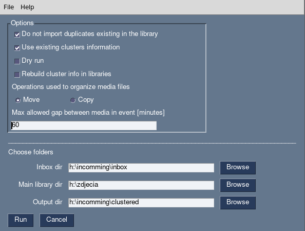

[](https://github.com/izikeros/filecluster/actions/workflows/black.yml)

# filecluster
Python library for creating image and video catalog. Catalog is organized by the dates and events.
Main purpose is to handle task whe you have large number of pictures in flat
directory and want to automatically group them into separate directories 
corresponding to events e.g. directory for your daughter's birthday, separate
directory for the excursion you make next day after the birthday etc.. 

## Features
- clustering media (images, video) by event
- detecting duplicate files
- detect if imported photo belongs to event that is already in database/filesystem

## Installation:
Clone the repo, install required packages (see `filecluster/requirements.txt`)

On Windows to have numpy working one might need to install:

[vc_redist.x64.exe](https://aka.ms/vs/15/release/vc_redist.x64.exe)

## Usage
Typical usage:
```bash
$ file_cluster.py --inbox-dir inbox --watch-dirs zdjecia --db-driver dataframe
```

or in abbreviated form:

```bash
$ file_cluster.py -i inbox -w zdjecia -d dataframe
```
Other run options:
```
usage: file_cluster.py [-h] [-i INBOX_DIR] [-o OUTPUT_DIR] [-w WATCH_DIR] [-t] [-n] [-y] [-f] [-d] [-c] [--version]

Group media files by event

optional arguments:
  -h, --help            show this help message and exit
  -i INBOX_DIR, --inbox-dir INBOX_DIR
                        directory with input images
  -o OUTPUT_DIR, --output-dir OUTPUT_DIR
                        output directory for clustered images
  -w WATCH_DIR, --watch-dir WATCH_DIR
                        directory with structured media (official media repository)
  -t, --development-mode
                        Run script with development configuration - work on tests directories
  -n, --no-operation    Do not introduce any changes on the disk. Dry run.
  -y, --copy-mode       Copy instead of default move
  -f, --force-deep-scan
                        Force recalculate cluster info for each existing cluster.
  -d, --drop-duplicates
  -c, --use-existing-clusters
  --version             show program's version number and exit

```
# Graphical Interface
There is available experimental graphical interface: (`filecluster/gui.py`).

