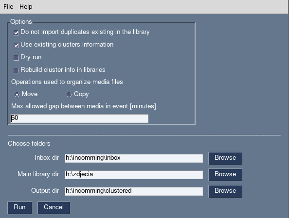

[](https://github.com/izikeros/filecluster/actions/workflows/isort_black_ruff.yml)


## filecluster
Python library for creating image and video catalog. Catalog is organized by the dates and events. The main purpose is to handle a task when you have a large number of pictures in a flat directory and want to automatically group them into separate directories corresponding to events e.g., directory for your daughter's birthday, separate directory for the excursion you make the next day after the birthday, etc.

### Features
- clustering media (images, video) by event
- detecting duplicate files and stores them in a separate output dir
- detecting media belonging to events that are already in the library
- detect if an imported photo belongs to an event already in database/filesystem
- mark folders from events that has large amount of media (folder suffix: `_rich`)

### Installation:
Clone the repo, install required packages (see `filecluster/requirements.txt`)

The recommended way to install the packages is to use `uv`:

```bash
uv lock && uv sync
```
On Windows to have numpy working, one might need to install:

[vc_redist.x64.exe](https://aka.ms/vs/15/release/vc_redist.x64.exe)

### Usage
Installing the package provides the `filecluster` command.

Preview what would happen, without touching a single file:
```bash
$ filecluster -i inbox -o clustered --no-operation
```

On a huge inbox, cap the ingestion to get a preview in seconds. `--limit` takes
the first N files in name order, so repeated previews stay comparable:
```bash
$ filecluster -i inbox -o clustered --no-operation --limit 500
```

Then run it for real, matching against an existing library:
```bash
$ filecluster -i inbox -o clustered -w zdjecia --drop-duplicates --use-existing-clusters
```

```
  filecluster 0.1.0
  Inbox   inbox
  Output  clustered
  Watch   zdjecia
  Mode    MOVE · gap 60 min · duplicates on · existing-clusters on · restore-names off

  ✔ Scanned library      1,204 clusters                      0:00:12
  ✔ Read inbox           48,213 files                        0:01:40
  ✔ Duplicate check      312 duplicates                      0:02:03
  ✔ Clustered            487 new clusters                    0:00:02
  ✔ Moved files          47,901 files · 12 renamed           0:03:11

  Results (MOVE)
  New clusters               487
  Duplicates                 312
  Files moved             47,901
  Elapsed               0:07:08

  ! 1,204 files: no EXIF date (used file timestamp)
  Re-run with -v to list affected files.
```

Before writing anything it asks for confirmation. Pass `--yes` to skip the
prompt; when the output is not a terminal (cron, pipelines) it proceeds on its
own.

Output stays this compact no matter how many files are processed: per-file
detail goes to a progress bar while a phase runs, or to `--report FILE`, never
to the scrollback. Logs go to stderr, so `stdout` can be piped safely.

Run options:
```
Usage: filecluster [OPTIONS]

  Group photos and videos into event folders based on their timestamps.

  -i, --inbox-dir DIRECTORY       Directory with input media files to process
  -o, --output-dir DIRECTORY      Directory where clustered media will be placed
  -w, --watch-dir DIRECTORY       Existing media library to match against. Repeatable
  -t, --development-mode          Use the development test directories
  -n, --no-operation              Dry run: show the plan, change nothing
  -y, --copy-mode                 Copy files instead of moving
  -f, --force-deep-scan           Recompute cluster info for every existing cluster
  -d, --drop-duplicates           Put duplicates in a separate folder instead of clustering
  -c, --use-existing-clusters     Assign media to clusters already in the watch folders
  -r, --restore-original-names    Strip copy suffixes such as '-Kopiuj(1)' or ' - Copy'
  -l, --limit INTEGER             Ingest at most this many inbox files, in name order
  -Y, --yes                       Do not ask for confirmation before writing
      --show INTEGER              How many of the largest clusters to list (0 = all)  [20]
      --report FILE               Write the full per-file operation list to this CSV
      --json                      Print a machine-readable summary instead
      --color / --no-color        Force colour on or off
  -v, --verbose                   -v for info, -vv for debug
  -q, --quiet                     Only report errors
  -V, --version                   Show the version and exit
  -h, --help                      Show this message and exit
```

Exit codes: `0` success, `1` completed with failures, `2` bad usage or
environment, `130` interrupted.
## Graphical Interface
There is available experimental graphical interface: (`filecluster/gui.py`).

